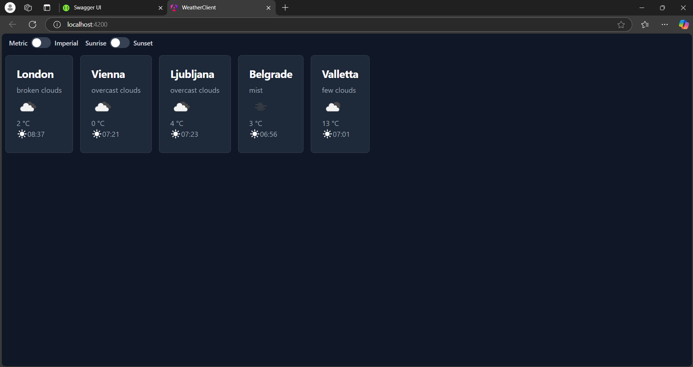

# weather-app

This is the completed application for the Greentube Meta Retention Tools task.

The weather-client folder contains the  Angular front-end application. The weather-api folder contains the .NET API back-end.

## Navigating the application

When opening the application front-end you will see two toggle buttons. The first controls the measurement system (metric/imperial). The second controls the display of sunrise/sunset time.

Each of the desired cities is displayed in its own self contained card component.

## Application improvements

Some future improvements that could be made to this assignment include:

- Caching of weather data to reduce calls to the external Open Weather API.
- Calculating metric/imperial conversions within the app instead of making a call to the external API when the toggle is changed.
- Improved unit testing of backend functions.
- Additional API error handling and logging.